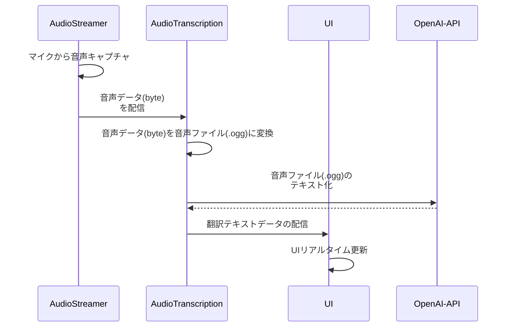

# Audio Transcription

## Get started

### prerequisite

```
$ brew install direnv
$ brew install poetry
$ brew install ffmpeg
$ brew install portaudio
```

### audio-transcription-server

```
$ cd audio-transcription-server
$ cp -rp .env.local .env
# Edit .env (e.g. OPENAI_API_KEY)
$ direnv allow
$ poetry install --no-root
$ poetry update pydub
$ poetry run python server.py
```

### ui

```
$ cd ui
$ cp -rp .env.local .env
$ direnv allow
$ npm ci
$ npm start
```

### audio-streamer

```
$ cd audio-streamer
$ cp -rp .env.local .env
$ direnv allow
$ poetry install --no-root
$ poetry run python streamer.py
```

## Sequence


